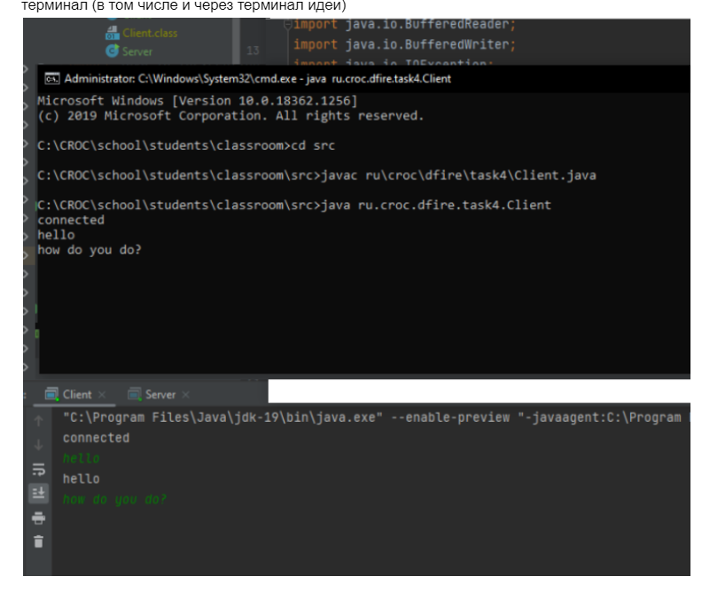
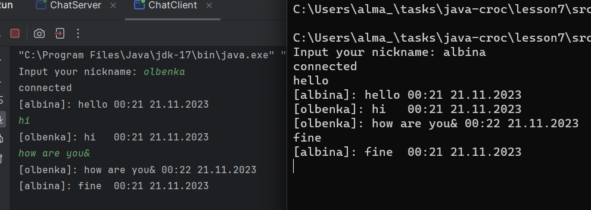

Задание 14
Напишите клиент-серверное приложение (это 2 отдельных приложения).
Сервер ждет подключения пользователей, принимает текстовые сообщения, которые пересылает всем подключенным клиентам.
Клиентское приложение сначала предлагает ввести никнейм, а далее отсылает на сервер каждую строку введённую пользователем
И выводит на консоль все сообщения полученные с сервера.
IP адрес - 127.0.0.1 - ведёт на так называемый localhost. Если запускаете клиент и сервер с одной машины - указывайте его. Если пробуете с кем то сконектиться - то надо указать или его IP адрес в локальной сети (Или если есть внешний IP - можно попробовать законектиться с любой точки мира указав его)

Ожидается в консоли пользователя увидеть чат.
Кому хочется посложнее: - выводите ник пользователя, и время в которое сообщение было отправлено. А кому и этого мало - учитывайте часовой пояс в котором клиентское приложение подключилось, и выводите локальное время в чат каждому пользователю. (Зону можно принять как аргумент запуска или предложить ввести пользователю после никнейма).

Идея не даёт запустить 2 клиента одновременно в своём окружении. Можно запустить через терминал (в том числе и через терминал идеи)
 

### мой запуск 
